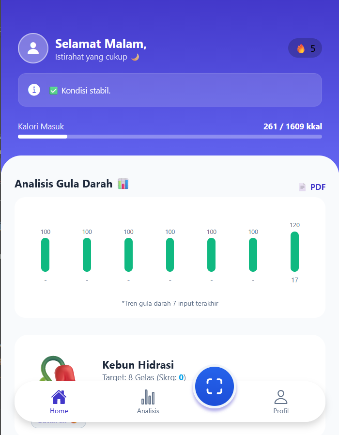
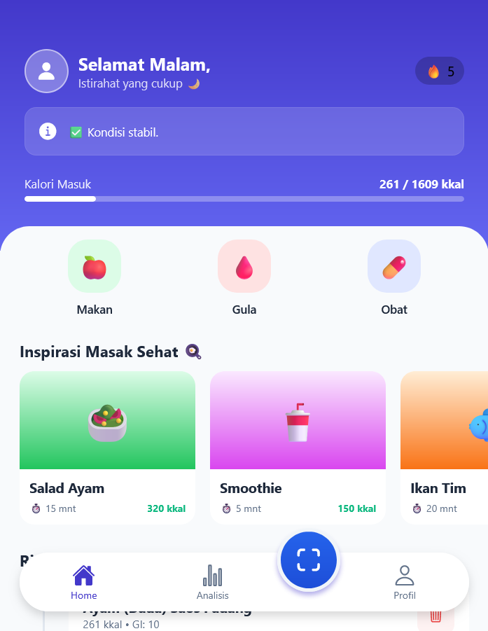
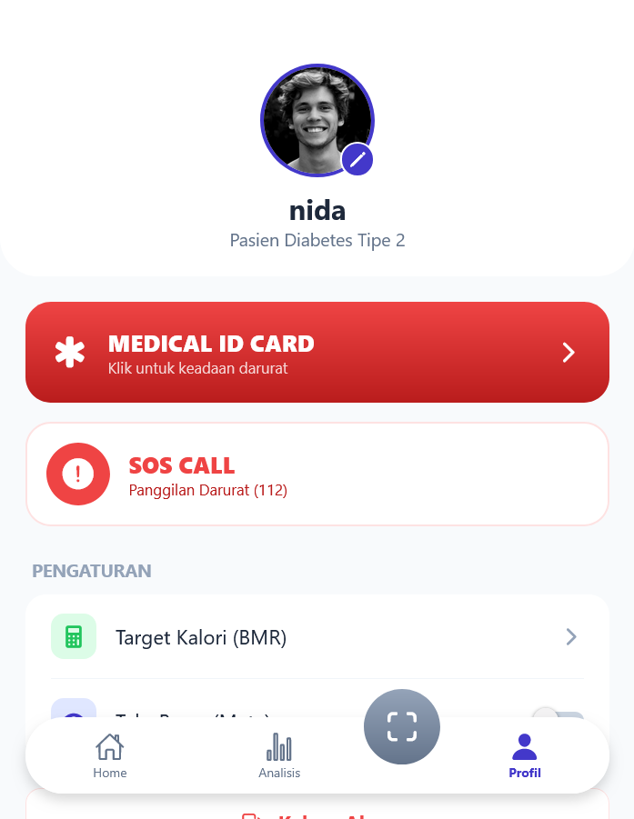

🩸 GlucoSmart – Intelligent Diabetes Management System

📖 Overview

GlucoSmart is a mobile health application designed to assist individuals with Type 2 Diabetes in independently monitoring and managing their health (self-management).

The application applies Human-Computer Interaction (HCI) principles, incorporating Context-Awareness and Persuasive Technology to enhance usability, engagement, and proactive health behavior.

✨ Key Features
1. 🧠 Smart Context Awareness

Dynamic Greeting: Personalized greetings adapt based on the time of day (Morning/Afternoon/Evening) along with relevant health activity suggestions.

Critical Alert System: The application header changes color (red with pulsing animation) and provides early warnings when blood glucose levels reach critical ranges (Hypoglycemia/Hyperglycemia).

2. 📊 Advanced Health Analytics

Dynamic Charting: Interactive bar chart visualization to monitor blood glucose trends from the last 7 entries.

Medical Report: Simulated PDF export feature for sharing health data during medical consultations.

3. 🤖 AI-Powered Tools

Food Scanner Simulation: Identifies food items and provides estimated calorie counts along with Glycemic Index (GI) recommendations.

Healthy Recipe Suggestions: Low-sugar meal recommendations tailored for diabetes management.

4. 🎮 Gamification & Behavioral Psychology

Hydration Garden (Tamagotchi Effect): A virtual plant that grows or withers based on the user’s daily water intake, encouraging consistent healthy habits.

Daily Missions & Streak System: Checklist-based habit tracking system to reinforce positive behavioral routines.

5. 🚑 Emergency & Safety

Medical ID Card: Digital patient identification card for emergency situations.

SOS Panic Button: Quick-access button to send emergency messages via WhatsApp.

🛠️ Tech Stack

Framework: React Native (Expo SDK 50)

Language: JavaScript (ES6+)

Storage: Async Storage (Local Persistence)

Animation: Lottie & Moti (Reanimated 2)

Visualization: Custom SVG Charts

📸 Application Screenshots

Below are the user interface previews of the GlucoSmart application:

Home Screen	Analytics & Features	Profile Screen
		

---

---

